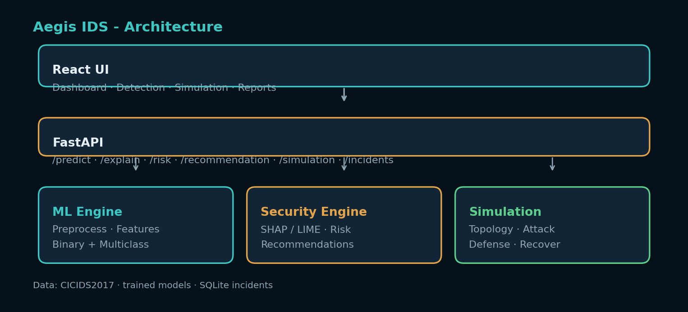
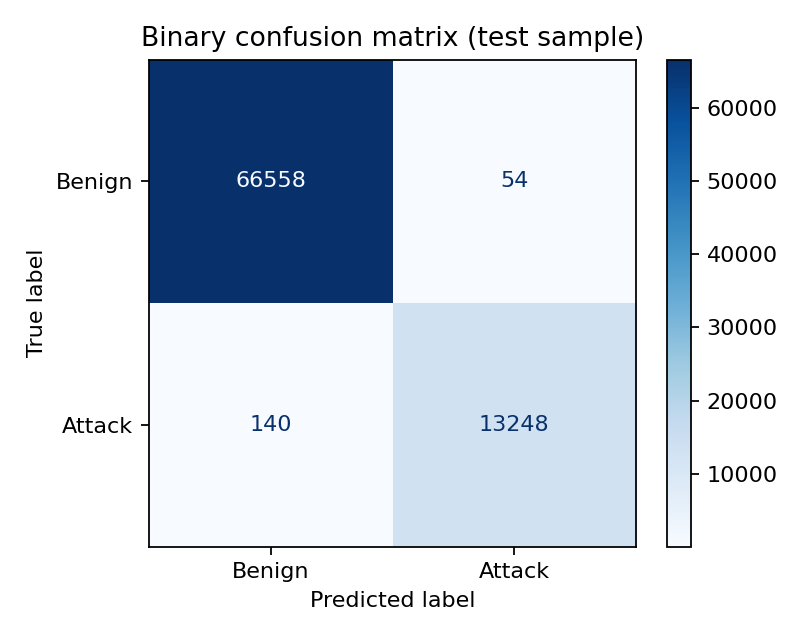
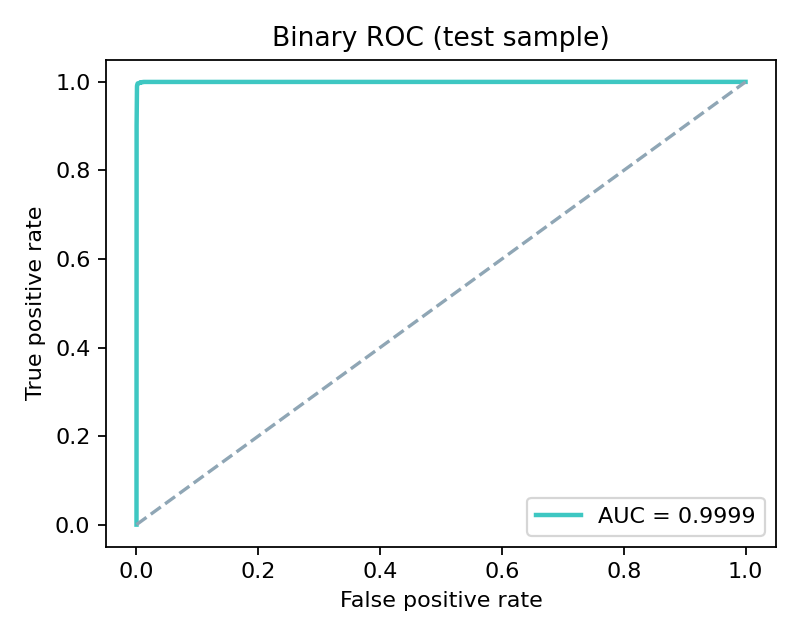
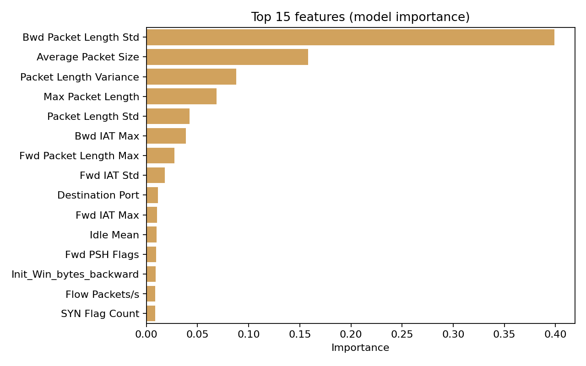

# Aegis IDS — Intelligent Intrusion Detection Platform

**One-sentence pitch:** An intelligent ML-based intrusion detection platform that detects and classifies network attacks, explains predictions, assesses risk, recommends defenses, and interactively simulates the attack-to-defense lifecycle.

**Repository:** https://github.com/Dolendra/Intelligent-Machine-Learning-Based-Intrusion-Detection-and-Attack-Defense-Simulation-System

[](https://github.com/Dolendra/Intelligent-Machine-Learning-Based-Intrusion-Detection-and-Attack-Defense-Simulation-System/actions/workflows/ci.yml)

## Dataset (not shipped in Git)

**Dataset:** CICIDS2017 (MachineLearningCVE flow CSVs).

Raw CICIDS2017 files are **intentionally excluded** from this repository (size / distribution considerations). `.gitignore` excludes `MachineLearningCVE/` and `TrafficLabelling/`. Processed Parquet under `data/processed/` is also ignored except `.gitkeep`.

**Before preprocessing / training:**

1. Download the official CICIDS2017 **MachineLearningCVE** CSV exports.
2. Place them in `MachineLearningCVE/` at the repo root (filenames like `Monday-WorkingHours.pcap_ISCX.csv`, …).
3. Then run:

```bash
python scripts/01_prepare_data.py
python scripts/02_train_models.py
```

Default training uses the full prepared dataset (`sample_frac: 1.0`) and drops rare classes (`min_class_count: 50`). Trained joblibs under `models/trained_models/` are included for demos when present.

## Quick start (local)

```bash
python -m pip install -r requirements.txt
# For freeze-reproducible installs matching metadata package versions:
# python -m pip install -r requirements-lock.txt
python scripts/01_prepare_data.py      # once (requires MachineLearningCVE/ CSVs)
python scripts/02_train_models.py      # once
python scripts/05_plot_evaluation.py   # report figures → models/trained_models/figures/

# One-click (Windows): API + UI in two terminals
powershell -File scripts/start_all.ps1

# Or manually:
# Terminal A
uvicorn backend.main:app --reload --port 8000
# Terminal B
cd frontend && npm install && npm run dev
```

- UI: http://127.0.0.1:5173/  
- API docs: http://127.0.0.1:8000/docs  
- Demo script: [`docs/DEMO.md`](docs/DEMO.md)
- **Final project report:** [`docs/PROJECT_REPORT.md`](docs/PROJECT_REPORT.md) (aligned to `v2.0-aegis-productionized`)
- Optional env overrides: copy `.env.example` → `.env`

### Docker (after models are trained)

`docker-compose.yml` is a **demonstration** configuration (`DEMO_MODE=true` for convenience). Production-like runs should leave `DEMO_MODE=false` (API default) and prefer `.env` / hardened settings from `.env.example`.

```bash
docker compose up --build
```

UI on port **5173**, API on **8000**. Requires `models/trained_models/` and `data/processed/` present on the host build context.

## Architecture



```text
Network flow → preprocess → binary ML → multiclass → risk → SHAP/LIME
→ recommendation → simulation → dashboard
```

### Sample evaluation figures

<p>



</p>

Pipeline: **Network flow → preprocess → binary ML → (if attack) multiclass → risk → SHAP → recommendation → simulation → dashboard**

## Reproduce report metrics

| Artifact | Path |
|----------|------|
| Training metrics JSON | `models/trained_models/training_report.json` |
| Markdown comparison | `models/trained_models/model_comparison.md` |
| Confusion / ROC / importance | `models/trained_models/figures/` |
| Data summary | `data/processed/summary.json` |

```bash
python scripts/04_export_comparison.py
python scripts/05_plot_evaluation.py
pytest -q
```

## Docs

| Doc | Purpose |
|-----|---------|
| [`docs/00-index.md`](docs/00-index.md) | Module index |
| [`docs/DEMO.md`](docs/DEMO.md) | 2-minute viva demo |
| [`docs/TEAM.md`](docs/TEAM.md) | 3-member ownership guide |
| [`docs/PROJECT_REPORT.md`](docs/PROJECT_REPORT.md) | **Final project report** (v2.0; Ch. 1–16) |
| [`docs/Aegis_IDS_Project_Report.docx`](docs/Aegis_IDS_Project_Report.docx) | Word export |
| [`docs/Aegis_IDS_Viva_Presentation.pptx`](docs/Aegis_IDS_Viva_Presentation.pptx) | Viva PowerPoint |
| [`docs/PRESENTATION.md`](docs/PRESENTATION.md) | Slide outline |
| [`docs/CHECKLIST.md`](docs/CHECKLIST.md) | Submission checklist |
| [`docs/IMPLEMENTATION_STATUS.md`](docs/IMPLEMENTATION_STATUS.md) | Honest Implemented / Partial / Not implemented |
| [`notebooks/01_data_analysis.ipynb`](notebooks/01_data_analysis.ipynb) | EDA |
| [`notebooks/03_explainability_demo.ipynb`](notebooks/03_explainability_demo.ipynb) | SHAP/LIME demo |
| [`notebooks/05_model_evaluation.ipynb`](notebooks/05_model_evaluation.ipynb) | Evaluation figures |
| [`notebooks/06_error_analysis.ipynb`](notebooks/06_error_analysis.ipynb) | FP/FN + confusion analysis |
| [`notebooks/07_calibration_hpo.ipynb`](notebooks/07_calibration_hpo.ipynb) | Calibration / HPO experiment viewer |

Feature-selector research experiment (optional):

```bash
python scripts/10_feature_selector_experiment.py
python scripts/11_calibration_hpo_experiment.py
python scripts/12_cross_dataset_status.py
python scripts/13_write_model_metadata.py
# optional calibrated wrapper:
# python scripts/14_fit_calibrated_binary.py  # then models.use_calibrated_binary: true
```


## Team split (suggested)

- **Member 1 — ML/Data:** dataset, features, training, evaluation  
- **Member 2 — Security intelligence:** SHAP, risk, recommendations, incidents  
- **Member 3 — App/Simulation:** FastAPI, React, topology visualization  

## Safety note

The simulation **visualizes** attack and defense. It does **not** launch real cyberattacks or auto-execute destructive network changes. Recommendations are advisory.
